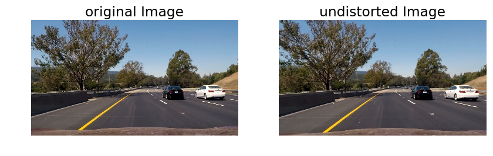

```python
import AdvancedLaneLines as lanes
import pickle
import cv2
import matplotlib.pyplot as plt
import matplotlib.image as mpimg
import numpy as np
```


**Advanced Lane Finding Project**

The goals / steps of this project are the following:

* Compute the camera calibration matrix and distortion coefficients given a set of chessboard images.
* Apply a distortion correction to raw images.
* Use color transforms, gradients, etc., to create a thresholded binary image.
* Apply a perspective transform to rectify binary image ("birds-eye view").
* Detect lane pixels and fit to find the lane boundary.
* Determine the curvature of the lane and vehicle position with respect to center.
* Warp the detected lane boundaries back onto the original image.
* Output visual display of the lane boundaries and numerical estimation of lane curvature and vehicle position.

## [Rubric](https://review.udacity.com/#!/rubrics/571/view) Points
### Here I will consider the rubric points individually and describe how I addressed each point in my implementation.  

---
### Camera Calibration

#### 1. Briefly state how you computed the camera matrix and distortion coefficients. Provide an example of a distortion corrected calibration image.

The code for this step is contained in the python file "./Advanced_Lane_Lines.py" in the function called "calibrate_camera".

I start by preparing "object points", which will be the (x, y, z) coordinates of the chessboard corners in the world. Here I am assuming the chessboard is fixed on the (x, y) plane at z=0, such that the object points are the same for each calibration image.  Thus, `objp` is just a replicated array of coordinates, and `objpoints` will be appended with a copy of it every time I successfully detect all chessboard corners in a test image.  `imgpoints` will be appended with the (x, y) pixel position of each of the corners in the image plane with each successful chessboard detection.  

I then used the output `objpoints` and `imgpoints` to compute the camera calibration and distortion coefficients using the `cv2.calibrateCamera()` function.  I applied this distortion correction to the test image using the `cv2.undistort()` function and obtained this result: 


```python
dist_pickle = pickle.load( open( "camera_cal/wide_dist_pickle.p", "rb" ) )
mtx = dist_pickle["mtx"]
dist = dist_pickle["dist"]
plt.figure(figsize=(10, 12))
plt.rcParams.update({'font.size': 14})
img = mpimg.imread('camera_cal/calibration1.jpg')
plt.subplot(1, 2, 1)
plt.title("original Image")
plt.axis('off')
var_holder = plt.imshow(img)
plt.subplot(1,2,2)
plt.title("undistorted Image")
plt.axis('off')
var_holder = plt.imshow(cv2.undistort(img, mtx, dist, None, mtx))
plt.show()
```


### Pipeline (single images)

#### 1. Provide an example of a distortion-corrected image.
To demonstrate this step, I will describe how I apply the distortion correction to one of the test images like this one:


```python
image = mpimg.imread('frame_1.jpg')
plt.imshow(image)
plt.show()
```





#### 2. Describe how (and identify where in your code) you used color transforms, gradients or other methods to create a thresholded binary image.  Provide an example of a binary image result.
I used a combination of color and gradient thresholds to generate a binary image (thresholding steps at function get_threshold_image   located in "./Advanced_Lane_Lines.py").  Here's an example of my output for this step:


```python
plt.figure(figsize=(10, 12))
plt.rcParams.update({'font.size': 14})
img = mpimg.imread('frame_1.jpg')
plt.subplot(1, 2, 1)
plt.title("original Image")
plt.axis('off')
var_holder = plt.imshow(image)
plt.subplot(1, 2, 2)
plt.title("threshold Image")
plt.axis('off')
var_holder = plt.imshow(lanes.get_threshold_image(image), cmap='gray')
plt.show()
```


#### 3. Describe how (and identify where in your code) you performed a perspective transform and provide an example of a transformed image.

The code for my perspective transform is included in the LaneBuilder.process_image() method which appears in the file `AdvancedLaneLine.py`.  The function takes as inputs an image (`image`), and calculates the source and destination points in the 
LaneBuilder.get_mask_space() mathod. I chose the hardcode the source and destination points in the following manner:

```
src = np.float32([[(self.image_shape[1] / 2) - 75, self.image_shape[0] / 2 + 100],
         [((self.image_shape[1] / 6) - 10), self.image_shape[0]],
         [(self.image_shape[1] * 5 / 6) + 60, self.image_shape[0]],
         [(self.image_shape[1] / 2 + 75), self.image_shape[0] / 2 + 100]])
dst = np.float32([[((self.image_shape[1] / 4) -150), 0],[((self.image_shape[1] / 4)-150), self.image_shape[0]],
         [((self.image_shape[1] * 3 / 4)+150), self.image_shape[0]],[((self.image_shape[1] * 3 / 4)+150), 0]])

```
This resulted in the following source and destination points:

| Source        | Destination   | 
|:-------------:|:-------------:| 
| 565, 460      | 170, 0        | 
| 203, 720      | 170, 720      |
| 1127, 720     | 1110, 720      |
| 715, 460      | 1110, 0        |

I verified that my perspective transform was working as expected by drawing the `src` and `dst` points onto a test image and its warped counterpart to verify that the lines appear parallel in the warped image.


```python
plt.figure(figsize=(10, 12))
plt.rcParams.update({'font.size': 14})
image = mpimg.imread('frame_2.jpg')
plt.subplot(1, 2, 1)
plt.title("original Image")
plt.axis('off')
var_holder = plt.imshow(image)
plt.subplot(1, 2, 2)
lane_builder = lanes.LaneBuilder(mtx, dist)
threshold_image = lanes.get_threshold_image(image)
final_image = lane_builder.process_image(image)
src, dst = lane_builder.get_mask_space()
M = cv2.getPerspectiveTransform(src, dst)
warped_image = cv2.warpPerspective(threshold_image, M, (threshold_image.shape[1],threshold_image.shape[0]))
plt.title("perspective transformed Image")
plt.axis('off')
var_holder = plt.imshow(warped_image, cmap='gray')
plt.show()
```


#### 4. Describe how (and identify where in your code) you identified lane-line pixels and fit their positions with a polynomial?

I first split the image into multiple chunks where each chunk has a hight of 45 pixels. I then created a histogram of the chunks and got the non zero x locations of the image (see the LaneBuilder.build_line() method) and removed the outliers from both sides:


```python
pixel_height = [i for i in range(warped_image.shape[0],0,-45)]
hist_ranges = [(pixel_height[i+1],pixel_height[i]) if i+1 < len(pixel_height) else (0,pixel_height[i]) for i in range(len(pixel_height)) ]
i = 0
plt.figure(figsize=(10, 10))
for pixel_range in hist_ranges:
    new_image = warped_image[pixel_range[0]:pixel_range[1],:]
    hist = np.sum(new_image, axis=0)
    plt.subplot(20, 1, i+1)
    plt.axis('off')
    var_holder = plt.imshow(new_image,cmap='gray')
    plt.plot(hist,color='red',linewidth=2)
    plt.gca().invert_yaxis()
    i+=1
plt.show()
```


I then saved a max x position and min x position for both lines in every chunck using a sliding window algoritihim or the previous frame if the previous frame has confident lines.

The points were saved in a confident_points list if the line width is between 10 and 55 pixels and at least 40% of the line's width is painted white, otherwise, it was saved in a uncofident_points list (see the LineBuilder.add_point() and LineBuilder.add_point_to_list() methods for more detail).

I used only the confident_points list to create the polynomial when the confident_points list is covering at least a fifth of the image hight and there are at least 3 points in the confident_points list, otherwise I used both lists.

The polynomial will take into consideration the previous frame for smoothing purposes (see LaneBuilder.get_polynomial() method for more detail)


```python
plt.figure(figsize=(10, 12))
plt.imshow(warped_image,cmap='gray')
plt.xlim(0, warped_image.shape[1])
plt.ylim(0, warped_image.shape[0])
left_line, right_line = lane_builder.last_left_line, lane_builder.last_right_line
confident_max_x = [i[0][0] for i in left_line.confident_points]
confident_max_x.extend([i[0][0] for i in right_line.confident_points])
confident_max_y = [i[0][1] for i in left_line.confident_points]
confident_max_y.extend([i[0][1] for i in right_line.confident_points])
confident_min_x = [i[1][0] for i in left_line.confident_points]
confident_min_x.extend([i[1][0] for i in right_line.confident_points])
confident_min_y = [i[1][1] for i in left_line.confident_points]
confident_min_y.extend([i[1][1] for i in right_line.confident_points])

unconfident_max_x = [i[0][0] for i in left_line.unconfident_points]
unconfident_max_x.extend([i[0][0] for i in right_line.unconfident_points])
unconfident_max_y = [i[0][1] for i in left_line.unconfident_points]
unconfident_max_y.extend([i[0][1] for i in right_line.unconfident_points])

unconfident_min_x = [i[1][0] for i in left_line.unconfident_points]
unconfident_min_x.extend([i[1][0] for i in right_line.unconfident_points])
unconfident_min_y = [i[1][1] for i in left_line.unconfident_points]
unconfident_min_y.extend([i[1][1] for i in right_line.unconfident_points])

plt.plot(confident_max_x,confident_max_y, 'o', color='red',label='confident max x')
plt.plot(confident_min_x,confident_min_y, 'o', color='green',label='confident min x')
plt.plot(unconfident_max_x,unconfident_max_y, 'o', color='blue',label='unconfident max x')
plt.plot(unconfident_min_x,unconfident_min_y, 'o', color='orange',label='unconfident mix x')

left_fit, right_fit = lane_builder.get_polynomial(left_line, right_line)
yvals = lane_builder.yvals
pl = np.poly1d(left_fit)
plt.plot(pl(yvals), yvals, color='red', linewidth=5,label='fitted left line')
pr = np.poly1d(right_fit)
plt.plot(pr(yvals), yvals, color='green', linewidth=5,label='fitted right line')
legend = plt.legend(loc='center', shadow=True)
for label in legend.get_texts():
    label.set_fontsize(6)
for label in legend.get_lines():
    label.set_linewidth(0.1)
plt.gca().invert_yaxis() 
plt.show()
```


#### 5. Describe how (and identify where in your code) you calculated the radius of curvature of the lane and the position of the vehicle with respect to center.

I took the average curvature of the left and right line (see the LineBuilder.get_curvature() method)  and used that as the lane curvature.
The position of the vehicle with respect to the center is calculated in the LaneBuilder.image_location_from_center() method (it is simply getting the center of the 2 polynomials for position 0 and calculating the difference to the center of the image.

#### 6. Provide an example image of your result plotted back down onto the road such that the lane area is identified clearly.

I implemented this step in lines #286 through #295 in the LaneBuilder.process_image() method.  Here is an example of my result on a test image:


```python
plt.figure(figsize=(10, 12))
plt.rcParams.update({'font.size': 14})
image = mpimg.imread('frame_2.jpg')
plt.subplot(1, 2, 1)
plt.title("original Image")
plt.axis('off')
var_holder = plt.imshow(image)
plt.subplot(1, 2, 2)
plt.title("final processed Image")
plt.axis('off')
var_holder = plt.imshow(final_image)
plt.show()
```


### Pipeline (video)

#### 1. Provide a link to your final video output.  Your pipeline should perform reasonably well on the entire project video (wobbly lines are ok but no catastrophic failures that would cause the car to drive off the road!).

Here's a [link to my video result](https://youtu.be/GF6VOiR9aBY)

### Discussion

#### 1. Briefly discuss any problems / issues you faced in your implementation of this project.  Where will your pipeline likely fail?  What could you do to make it more robust?

there were many problems that I faced while implementing this project. my first implementation can be found in './Advanced_Lane_Lines_version_1.ipynb'


```python

```
